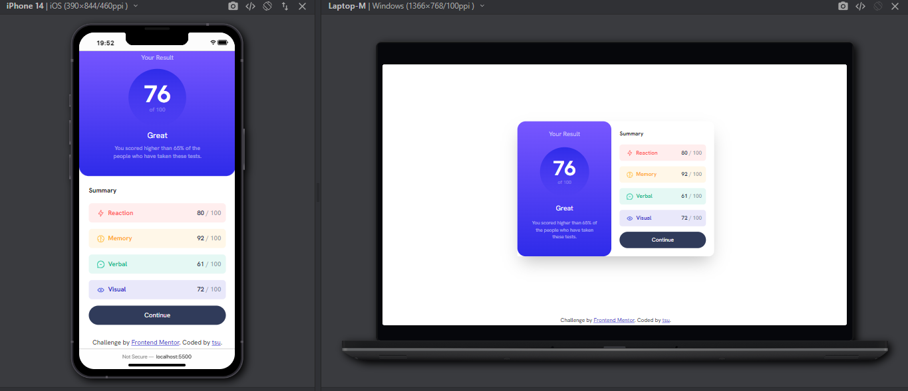

# Frontend Mentor - Results summary component solution

This is a solution to the [Results summary component challenge on Frontend Mentor](https://www.frontendmentor.io/challenges/results-summary-component-CE_K6s0maV). Frontend Mentor challenges help you improve your coding skills by building realistic projects.

## Table of contents

- [Overview](#overview)
  - [The challenge](#the-challenge)
  - [Screenshot](#screenshot)
  - [Links](#links)
- [My process](#my-process)
  - [Built with](#built-with)
  - [What I learned](#what-i-learned)
  - [Useful resources](#useful-resources)

## Overview

### The challenge

Users should be able to:

- View the optimal layout for the interface depending on their device's screen size
- See hover and focus states for all interactive elements on the page
- **Bonus**: Use the local JSON data to dynamically populate the content

### Screenshot



### Links

- Live Site URL: [https://tsuramii.github.io/results-summary-component-main/](https://tsuramii.github.io/results-summary-component-main/)

## My process

### Built with

- Semantic HTML5 markup
- Tailwind
- Flexbox
- Mobile-first workflow

### What I learned

During this project, I gained valuable insights into working with fonts and Tailwind CSS. Here's a summary of what I learned:

Importing Local Fonts with Tailwind CSS: I learned how to import and use custom local fonts in a Tailwind CSS project. This is particularly useful for maintaining a consistent visual style in web applications.

In my tailwind.config.js file, I extended the fontFamily configuration to include a custom font:

```js
extend: {
  fontFamily: {
    hanken: ['HankenGrotesk', 'sans'],
  },
}
```

Defining Font-Face in CSS: To use a local font, I defined the @font-face rule in my CSS file (in this case, input.css). This rule specifies the font-family name and the path to the font file:

```css
@font-face {
    font-family: 'HankenGrotesk';
    src: url('../assets/fonts/HankenGrotesk-VariableFont_wght.ttf');
}
```

By including this rule, I made the custom font available for use in my Tailwind CSS classes.

Additionally, this project provided me with an opportunity to enhance my skills in translating a design into a functional web page. This hands-on experience helped me improve my ability to create web pages that align with design specifications, improving both my technical and design skills.

### Useful resources

- [Tailwindtoolbox - Adding fonts to TailwindCSS](https://www.tailwindtoolbox.com/guides/adding-fonts-to-tailwind-css) - This guide was instrumental in adding custom fonts to my Tailwind CSS project. The clear explanations and code examples were very useful. I plan to use this approach in future projects.
